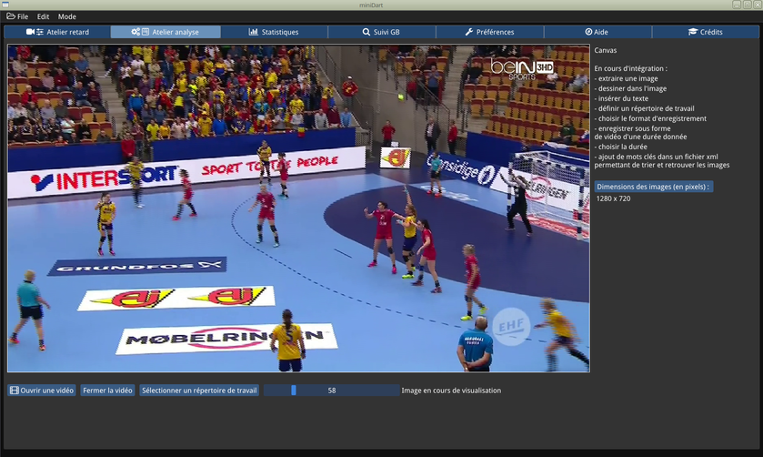

""""""""""""""""""""""""""""""""""""""""""""""

**LATEST ENGLISH US VERSION** : [**Click here to download the most recent en-US version**](https://framagit.org/ericb/miniDart/-/blob/master/testing_version/en-US/miniDart_0.9.7_en-US_test.exe)

**FRENCH VERSION** : [**Click here to download the most recent french version**](https://framagit.org/ericb/miniDart/-/blob/master/testing_version/miniDart_0.9.7_test.exe)

**Discontinued website. The devel continues here:  https://framagit.org/ericb/miniDart**

Prerequisites

If the ambient light is sufficient, we can view and record images from a webcam (prefer the recommended models below) at the rate of 30 frames per second in 1270 x 720 (aka 720p). The recording is currently in .avi format with the encoding divx. The sound is not currently managed. The Linux version works similarly, but in 24 frames per second.

Hardware Processors / RAM advised:

* i5 + 4 GB minimum
* i7 + 8GB comfortable :+1:

The installation requires ~ 35 MB of disk space + space for the created video files.

Webcam highly recommended and extensively tested:

- Logitech C920 :+1: (30 frames per second, but requires good light)
- Logitech C922 :+1: (ask for a good light)
- Microsoft Lifecam C3000: sometimes asks to restart once miniDart, (asks for a good light) 

Operating system: tested on Windows 7 and Win 10 64-bit (a 32 bits version forwin7+ is available, but on demand only).

Technical informations:

This software is written on Linux, and cross-compiled to run on 64-bit Windows. The APIs used are:

* **SDL2** ( http://libsdl.org/ ) for windowing and remarkable portability Linux -> Windows;
* **OpenGL** ( https://www.khronos.org/opengl/ ) for rendering;
* **Dear ImGui** ( https://github.com/ocornut/imgui ) for user interface and graphics performance (thanks to **Omar Cornut** for this awesome UI);
* **OpenCV 3.4.0** ( https://opencv.org/ ): management of webcams, processing of frames, annotations (stopwatch, recording);
* **DirectShow** and **DirectX** (on Windows), v4l2 + gstreamer (on Linux): video acquisition;
* **FFMPEG (master, 4.2.3 Windows and Linux)** ( http://ffmpeg.org/ ) opening, analysis, export of video files (divx, avi etc);
* **mingw-w64** ( https://mingw-w64.org/doku.php ) cross-compilation of the Windows version;
* **InnoSetup** ( http://www.jrsoftware.org/ ) for Windows packaging;
* **wine64** ( https://www.winehq.org/ ) for testing the Windows version on Linux;
* **Native File Dialog** ( https://github.com/mlabbe/nativefiledialog ), open file, save, written by **Michael Labbe** .
* **Font AweSome** ( https://github.com/juliettef/IconFontCppHeaders ) for font-icons created by **Juliette Foucaut** .
* **(coming soon) **TinyXML2** ( https://github.com/leethomason/tinyxml2 ) for xml tags when analyzing and ranking a video.

Author of miniDart software: Eric Bachard © 2016-2019 

""""""""""""""""""""""""""""""""""""""""""""""

**VERSION EN FRANCAIS** (english version follows)

**Version NON maintenue. Le développement continue sur :  https://framagit.org/ericb/miniDart**

**Pour le téléchargement, cliquer ici : https://framagit.org/ericb/miniDart/blob/master/testing_version/miniDart_0.9.5_test.exe**

Domaine : aide à l'amélioration de la performance sportive et analyse vidéo pour coachs de sports collectifs (handball, ou autre sport)

Ceci est une version de démonstration du logiciel **miniDart**. Elle n'est pas complète, et comporte probablement quelques bugs. Une partie des fonctionnalités est encore manquante, et devrait être implémentée d'ici le printemps 2018.

Informations techniques:

Ce logiciel est écrit sous Linux, et cross-compilé pour fonctionner sous Windows 64 bits. Les APIs utilisées sont:
* **SDL2** ( http://libsdl.org/) pour le fenêtrage et la remarquable portabilité Linux -> Windows ;
* **OpenGL** (https://www.khronos.org/opengl/) pour le rendu ;
* **Dear ImGui (1.72b + docking branch) ** (https://github.com/ocornut/imgui) pour l'interface utilisateur et les performances graphiques (merci à **Omar Cornut** pour cette UI géniale) ;
* **OpenCV 3.4.0** (https://opencv.org/) : gestion des webcams, traitement des frames, annotations (chronomètre, enregistrement) ;
* **DirectShow** et **DirectX** ( sous Windows) , v4l2 + gstreamer (sous Linux) : acquisition vidéo ;
* **FFMPEG (master 4.2.3 Windows and Linux)** (http://ffmpeg.org/) ouverture, analyse, export de fichiers vidéos (divx, avi etc) ;
* **mingw-w64** (https://mingw-w64.org/doku.php) cross-compilation de la version Windows ;
* **InnoSetup** (http://www.jrsoftware.org/) pour le packaging Windows ;
* **wine64** (https://www.winehq.org/) pour les tests de la version Windows sous Linux;
* **Native File Dialog** (https://github.com/mlabbe/nativefiledialog), ouverture d'un fichier, sauvegarde, écrit par **Michael Labbe**.
* **Font AweSome** (https://github.com/juliettef/IconFontCppHeaders ) pour les fontes-icones créées par **Juliette Foucaut**.
* (prochainement) **TinyXML2** (https://github.com/leethomason/tinyxml2) pour les tags xml lors de l'analyse et le classement d'une vidéo.
* (en test) **SDL_kitchensink** (https://github.com/katajakasa/SDL_kitchensink) pour le son dans les vidéos (lecture ET enregistrement)

**Auteur du logiciel miniDart : Eric Bachard © 2016-2021**

